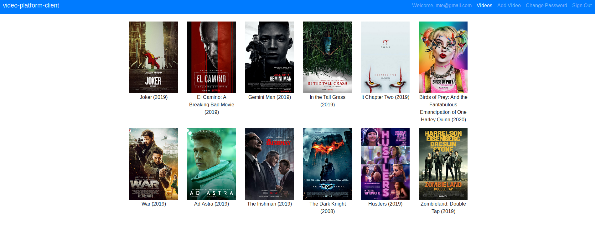

# Video Platform App - Express API

## App Summary
The app is a video platform that provides the base structure to flesh out a more comprehensive app. It is a project that will be continuously revisited to have more things added with new developments as I learn and grow as a developer.

Currently it is a user driven site where a show/movie is posted with title, year, description, trailer URL from YouTube, a poster image and categories of genre the video belongs to. The index page shows you the list of videos that have been added and clicking one will bring you to the page with the previously mentioned information.

### Setup and local installation
1. Clone repository
2. `npm install` for dependencies
3. Use links below to go to Client repository, clone and install that
4. Ensure you have MongoDB properly setup and running
4. `nodemon server` to run a localhost

Both front-end and back-end have to be running to function

## Links
**Deployed front-end client:** https://marcpelve.github.io/video-platform-client

**Front-end client repository:** https://github.com/marcpelve/video-platform-client

**Deployed back-end API:** https://shielded-mountain-36338.herokuapp.com

**Back-end API repository:** https://github.com/marcpelve/video-platform-api

#### Technologies
Javascript, Express

MongoDB, Mongoose

Heroku, NodeJS

## Links
**Deployed front-end client:** https://marcpelve.github.io/video-platform-client

**Front-end client repository:** https://github.com/marcpelve/video-platform-client

**Deployed back-end API:** https://shielded-mountain-36338.herokuapp.com

**Back-end API repository:** https://github.com/marcpelve/video-platform-api

## Resource Routes
`user routes`:
  - `/sign-up` - POST for sign up credentials
  - `/sign-in` - POST for sign in credentials
  - `/users` - GET for list of users
  - `/change-password` - PATCH for updating credentials
  - `/sign-out` - DELETE for sign out
  - `/favorites` - GET for list of user video favorites
  - `/favorites/add/:id` POST for creating and assigning video to favorites

`video routes`:
  - `/videos` - GET for index of videos
  - `/videos/:id` - GET for individual video
  - `/videos` - POST for video creation
  - `/videos/:id` - PATCH for editting video
  - `/videos/:id` - DELETE for deleting video

## Development documentation

### Wireframes && User stories

Wireframes

User stories

- As a user I want to sign up if I don't have an account.
- As a user I want to sign in if I have an account.

- As a user I want to browse through the list of movies.
- As a user I want to add movies to my favorites.
- As a user I want to add movies to the database of movies.
- As a user I want to have movies sorted by categories.
- As a user I want to edit a movie's listing.
- As a user I want to delete a movie's listing.

ERD

`Users.favorites` -|--< `Videos`

**User favorites** has many **Videos**

### API - Backend
##### Setup and intialize to local/remote and heroku
Change information, where need be, with proper project name.
   - `config/db.js` contains mongo database name
   - `npm install` to install proper dependencies

##### Resource planning
Create resource required for project.
- `User` resource provided for authentication
- `Video` resource to be created as primary resource
  - Open resource locked behind authenticated hash route in front-end

<table style="display:inline">
<th colspan="2" style="text-align:center">Videos</th>
<th colspan="2" style="text-align:center">User</th>
<tr>
<td>_id</td>
<td>MongoDB ObjectId</td>
<td>id</td>
<td>MongoDB ObjectId</td>
</tr>
<tr>
<td>title</td>
<td>string</td>
<td>email</td>
<td>string</td>
</tr>
<tr>
<td>year</td>
<td>number</td>
<td>password</td>
<td>string</td>
</tr>
<tr>
<td>description</td>
<td>string</td>
<td>password_confirmation</td>
<td>string</td>
</tr>
<tr>
<td>videoUrl</td>
<td>string</td>
<td>favorites</td>
<td>[ ref: Video ]</td>
</tr>
<tr>
<td>imageUrl</td>
<td>string</td>
<td></td>
<td></td>
</tr>
<tr>
<td>category</td>
<td>[ string ] : enum</td>
<td></td>
<td></td>
</tr>
<tr>
<td>timestamps</td>
<td>Mongoose default</td>
<td>timestamps</td>
<td>Mongoose default</td>
</tr>
</table>

##### End Point Testing
Postman requests to test early in development

<ul style="list-style-typenone;">
  <li>get -> #index, #show</li>
  <li>post -> #create</li>
  <li>patch -> #update</li>
  <li>delete -> #destroy</li>
</ul>

### Project realizations
Coming into this project, relatively new to React, would mean that I would have a lot of learning to do in the process. This meant that features that I originally wanted to implement would have to be delayed for future iterations as its more important to create a minimum viable product that I can continually add to as my skills progress.

One of these early realizations was the classic Netflix show/movie slider that scroll left to right on your Netflix homepage. Tackling this made me realize that whilst it's something I'm definitely going to tackle in the future, it shouldn't be a priority as creating a product under time constraints would require a more focused approach. This realization gave me a good perspective on time management for pieces of functionality in a project.

#### Potential updates
1. Implement `user` favorites, resource is already set up for
3. Create search bar and link to API search action for better data display
3. Make requests to 3rd party API for more app functionality
